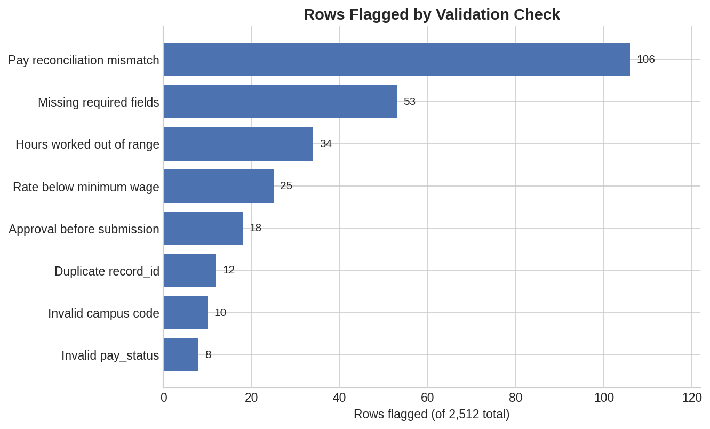

# Timesheet & Workforce Data Quality Suite

[](https://github.com/YOUR-GITHUB-USERNAME/workforce-data-quality-suite/actions/workflows/pipeline.yml)

A data quality validation pipeline for multi-site workforce timesheet data,
combining SQL-based business rule checks with an automated Great
Expectations suite. Built to demonstrate the same validation logic used to
catch timesheet and hours-to-pay errors before they reach an approval cycle,
applied to a synthetic dataset modeled on multi-campus, multi-department
timesheet submissions.

## Why This Matters Now

Timesheet data breaks in predictable, recurring ways across any multi-site
workforce program: a rate entered below minimum wage, a duplicate
submission from a batch upload, an approval logged before the submission
it's approving, hours that don't reconcile with the calculated pay amount.
In a manual review process, these errors are caught by someone noticing
something looks off across dozens or hundreds of records, if they're caught
at all before the cycle closes. This project builds the automated layer
that catches them first, every time, without depending on a person
happening to review the right row.

This mirrors real timesheet supervision work: validating batch submissions
across multiple sites and departments, catching reconciliation errors
before they reach an approval cycle, and treating data integrity as a
process to build and automate, not a task to repeat manually every cycle.

## What This Project Demonstrates

- **SQL**: eight named validation queries covering referential integrity,
  business rule violations, and hours-to-pay reconciliation, plus a summary
  rollup query suitable for a stakeholder-facing dashboard.
- **Automated testing with Great Expectations**: a repeatable expectation
  suite that runs the same checks programmatically, returns a structured
  pass/fail result, and is built to slot into a scheduled pipeline rather
  than be run by hand.
- **Realistic, intentional data quality issues**: the dataset isn't clean
  data with the checks built to match it. Defects were injected first, at
  known rates, then the validation layer was built independently to find
  them, which is closer to how real data quality work actually happens.
- **CI/CD**: a GitHub Actions workflow runs the entire pipeline, data
  generation through the chart build, on every push and pull request, so
  the badge above reflects an actual passing run, not a manual claim.

## Project Structure

```
workforce-data-quality-suite/
├── .github/
│   └── workflows/
│       └── pipeline.yml         # CI: runs the full pipeline on push/PR
├── data/
│   ├── timesheet_raw.csv        # synthetic dataset with injected defects
│   └── timesheet.db             # SQLite database used by the SQL layer
├── sql/
│   └── validation_queries.sql   # documented, standalone SQL checks
├── scripts/
│   ├── generate_data.py         # builds the synthetic dataset
│   ├── load_to_sqlite.py        # loads CSV into SQLite
│   ├── run_sql_checks.py        # runs SQL checks, writes findings report
│   ├── run_great_expectations.py# builds and runs the GX suite
│   └── make_summary_chart.py    # builds the defect summary chart
└── reports/
    ├── sql_findings_report.md
    ├── gx_findings_report.md
    ├── gx_validation_results.json
    └── defect_summary_chart.png
```

## How to Run

```bash
pip install -r requirements.txt

python scripts/generate_data.py          # generate synthetic dataset
python scripts/load_to_sqlite.py         # load into SQLite
python scripts/run_sql_checks.py         # run SQL validation, write report
python scripts/run_great_expectations.py # run GX suite, write report
python scripts/make_summary_chart.py     # build the defect summary chart
```

## Results

Rows flagged per check, generated directly from `data/timesheet.db` by
`scripts/make_summary_chart.py`:



Full row-level detail for each check is in
[`reports/sql_findings_report.md`](reports/sql_findings_report.md) and
[`reports/gx_findings_report.md`](reports/gx_findings_report.md).

Captured output from an actual run of the full pipeline, in order:

```
$ python scripts/generate_data.py
Wrote 2512 rows to data/timesheet_raw.csv
  base records: 2500, duplicated: 12

$ python scripts/load_to_sqlite.py
Loaded 2512 rows into timesheets
Loaded 5 rows into valid_campuses
Database written to data/timesheet.db

$ python scripts/run_sql_checks.py
Wrote findings report to reports/sql_findings_report.md
  Duplicate record_id: 12
  Missing required fields (hourly_rate, campus): 53
  Hours worked outside a valid range: 34
  Hourly rate below minimum wage: 25
  Pay reconciliation mismatch: 106
  Approval sequencing errors (approved before submitted): 18
  Invalid campus code (referential integrity): 10
  Invalid pay_status values: 8

$ python scripts/run_great_expectations.py
Wrote reports/gx_findings_report.md
Wrote reports/gx_validation_results.json
Overall success: False
  expect_column_values_to_not_be_null (record_id): success=True unexpected=0
  expect_column_values_to_be_unique (record_id): success=False unexpected=24
  expect_column_values_to_not_be_null (hourly_rate): success=False unexpected=38
  expect_column_values_to_be_between (hourly_rate): success=True unexpected=25
  expect_column_values_to_not_be_null (campus): success=True unexpected=15
  expect_column_values_to_be_in_set (campus): success=True unexpected=10
  expect_column_values_to_be_between (hours_worked): success=True unexpected=34
  expect_column_values_to_be_in_set (pay_status): success=True unexpected=8
  expect_column_values_to_be_in_set (pay_reconciles): success=False unexpected=144
  expect_column_values_to_be_in_set (approval_sequence_valid): success=True unexpected=18
```

## Data Quality Checks Implemented

| Check | Type | What it catches |
|---|---|---|
| Duplicate record_id | SQL + GX | Re-submitted or double-loaded timesheet records |
| Missing hourly_rate / site | SQL + GX | Incomplete records that can't clear approval as-is |
| Hours worked out of range | SQL + GX | Negative, zero, or implausibly high hours |
| Hourly rate below minimum wage | SQL + GX | Compliance violations or entry errors |
| Hours-to-pay reconciliation | SQL + GX | Calculated pay that doesn't match hours × rate |
| Approval before submission | SQL + GX | Broken or backdated approval workflow |
| Invalid site code | SQL + GX | Referential integrity against a valid site list |
| Invalid status value | SQL + GX | Values outside the approved workflow states |

## Notes on the Great Expectations Implementation

Two of the checks (hours-to-pay reconciliation and approval sequencing) are
cross-column business rules that don't map to a single built-in GX
expectation. Rather than skip them, they're precomputed as derived boolean
columns (`pay_reconciles`, `approval_sequence_valid`) and validated
directly. This is a deliberate, common pattern in real data quality work:
not every business rule has a matching built-in check, so you engineer the
column that expresses it and validate that instead.

## Limitations and Honest Scope

This is a portfolio project built on synthetic data, not a production
pipeline. It does not include: a persistent GX Data Context wired into an
orchestrator, alerting on failure, or incremental/streaming validation.
Those would be the logical next additions in a production setting, and
are called out here deliberately rather than implied as already built.

A GitHub Actions workflow (`.github/workflows/pipeline.yml`) runs the
full pipeline on every push and pull request, so this is CI-verified, not
just locally tested. The workflow checks that the pipeline runs without
errors; it does not gate on the data being clean, since the dataset has
intentional defects by design and the validation suite is expected to
flag them every run.

## Data Disclosure

All data in this project is synthetically generated for demonstration
purposes. No real employee, student, intern, or institutional data is
used or represented.

## License

MIT License

Copyright (c) 2026 Alexis Prieto

Permission is hereby granted, free of charge, to any person obtaining a copy of this software and associated documentation files (the "Software"), to deal in the Software without restriction, including without limitation the rights to use, copy, modify, merge, publish, distribute, sublicense, and/or sell copies of the Software, and to permit persons to whom the Software is furnished to do so, subject to the following conditions:

The above copyright notice and this permission notice shall be included in all copies or substantial portions of the Software.

THE SOFTWARE IS PROVIDED "AS IS", WITHOUT WARRANTY OF ANY KIND, EXPRESS OR IMPLIED, INCLUDING BUT NOT LIMITED TO THE WARRANTIES OF MERCHANTABILITY, FITNESS FOR A PARTICULAR PURPOSE AND NONINFRINGEMENT. IN NO EVENT SHALL THE AUTHORS OR COPYRIGHT HOLDERS BE LIABLE FOR ANY CLAIM, DAMAGES OR OTHER LIABILITY, WHETHER IN AN ACTION OF CONTRACT, TORT OR OTHERWISE, ARISING FROM, OUT OF OR IN CONNECTION WITH THE SOFTWARE OR THE USE OR OTHER DEALINGS IN THE SOFTWARE.
